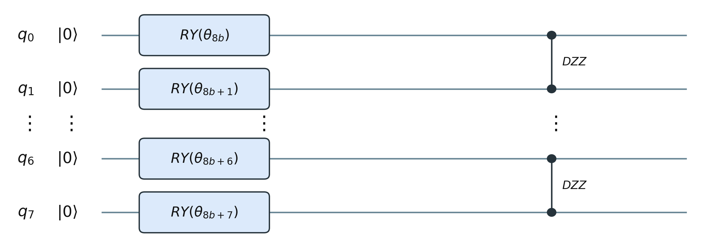
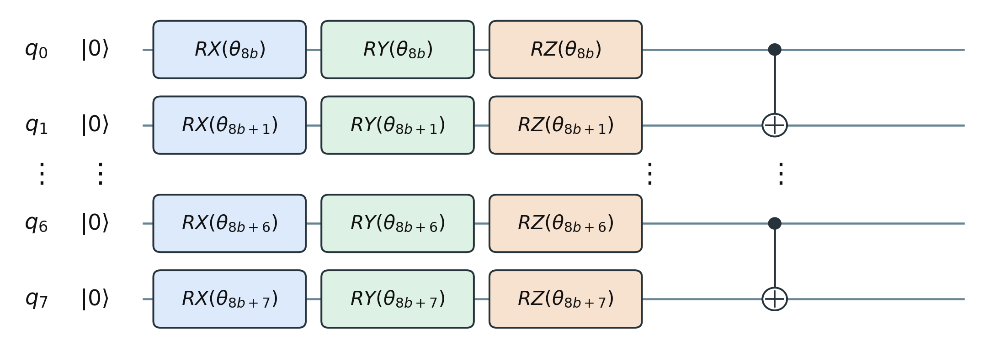
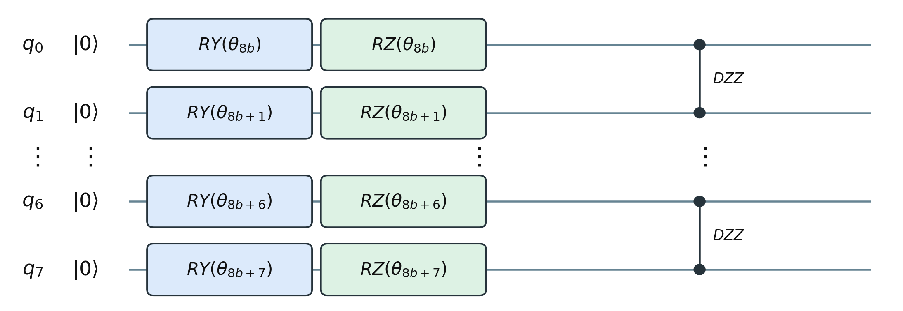

# Quiz: Quantum Circuits and BTQK for Quartet Topology

## Phần A — Quantum circuits

### Câu 1

Điểm khác biệt cơ bản giữa một bit cổ điển và một qubit là gì?

A. Bit cổ điển luôn nhanh hơn qubit.  
B. Qubit có thể ở trạng thái chồng chập của $|0\rangle$ và $|1\rangle$.  
C. Qubit luôn đồng thời cho kết quả đo là 0 và 1.  
D. Bit cổ điển không thể lưu trữ thông tin.

### Câu 2

Một qubit có trạng thái $|\psi\rangle=\frac{\sqrt{3}}{2}|0\rangle+\beta|1\rangle$, trong đó $\beta$ là số thực không âm. Để trạng thái được chuẩn hóa, $\beta$ bằng bao nhiêu?

A. $0$  
B. $\frac{1}{4}$  
C. $\frac{1}{2}$  
D. $\frac{\sqrt{3}}{2}$

### Câu 3

Nếu đo qubit ở trạng thái $|\psi\rangle=\frac{3}{5}|0\rangle+\frac{4}{5}|1\rangle$ trong cơ sở tính toán, xác suất nhận được kết quả 1 là bao nhiêu?

A. $\frac{3}{5}$  
B. $\frac{4}{5}$  
C. $\frac{9}{25}$  
D. $\frac{16}{25}$

### Câu 4

Một qubit bắt đầu ở $|0\rangle$. Sau khi áp dụng cổng $X$ rồi cổng $H$, trạng thái thu được là gì?

A. $|0\rangle$  
B. $|1\rangle$  
C. $|+\rangle=\frac{|0\rangle+|1\rangle}{\sqrt{2}}$  
D. $|-\rangle=\frac{|0\rangle-|1\rangle}{\sqrt{2}}$

### Câu 5

Áp dụng cổng Hadamard $H$ lên trạng thái $|0\rangle$ tạo ra trạng thái nào?

A. $|1\rangle$  
B. $\frac{|0\rangle+|1\rangle}{\sqrt{2}}$  
C. $\frac{|0\rangle-|1\rangle}{2}$  
D. $|0\rangle+|1\rangle$

### Câu 6

Một cổng CNOT có qubit thứ nhất là qubit điều khiển và qubit thứ hai là qubit đích. Đầu vào $|10\rangle$ được biến đổi thành trạng thái nào?

A. $|00\rangle$  
B. $|01\rangle$  
C. $|10\rangle$  
D. $|11\rangle$

### Câu 7

Với một qubit bất kỳ, chuỗi cổng $H\rightarrow X\rightarrow H$ tương đương với cổng nào?

A. $X$  
B. $Y$  
C. $Z$  
D. $H$

### Câu 8

Hai qubit ở trạng thái Bell $|\Phi^+\rangle=(|00\rangle+|11\rangle)/\sqrt{2}$. Khi đo cả hai trong cơ sở tính toán, kết quả nào đúng?

A. Chỉ nhận được `01` hoặc `10`, mỗi kết quả có xác suất $1/2$.  
B. Chỉ nhận được `00` hoặc `11`, mỗi kết quả có xác suất $1/2$.  
C. Cả bốn kết quả xuất hiện với xác suất bằng nhau.  
D. Luôn nhận được `00` vì hai qubit ban đầu đều là 0.

### Câu 9

Một qubit đang ở trạng thái $|0\rangle$. Nếu chỉ áp dụng $R_Z(\theta)$ rồi đo trong cơ sở tính toán, phân bố kết quả đo thay đổi như thế nào khi thay đổi $\theta$?

A. Xác suất đo được 1 tăng tuyến tính theo $\theta$.  
B. Xác suất 0 và 1 luôn bằng nhau.  
C. Phân bố không đổi: vẫn đo được 0 với xác suất 1.  
D. Kết quả phụ thuộc ngẫu nhiên vào mỗi lần chạy, không thể dự đoán.

### Câu 10

Hai mạch một qubit cùng bắt đầu từ $|0\rangle$: mạch I áp dụng $H$ rồi $X$; mạch II áp dụng $X$ rồi $H$. Phát biểu nào đúng khi đo trong cơ sở tính toán?

A. Cả hai mạch đều luôn cho kết quả 0.  
B. Cả hai có cùng phân bố 50-50, dù trạng thái trước khi đo khác nhau về pha tương đối.  
C. Mạch I luôn cho 1, còn mạch II luôn cho 0.  
D. Hai mạch tạo ra chính xác cùng một statevector.

## Phần B — Towards Quantum Machine Learning for Quartet Topology

### Câu 11

Đầu vào sinh học của bài toán quartet trong bài báo gồm bao nhiêu chuỗi đã căn chỉnh?

A. 2 chuỗi  
B. 3 chuỗi  
C. 4 chuỗi  
D. 8 chuỗi

### Câu 12

Mục tiêu dự đoán của mô hình trong bài báo là gì?

A. Dự đoán nucleotide tiếp theo trong mỗi chuỗi.  
B. Chọn một trong ba quartet topology.  
C. Ước lượng trực tiếp toàn bộ cây của hàng nghìn loài.  
D. Phát hiện lỗi giải trình tự DNA.

### Câu 13

Vai trò của PCA trong quy trình được trình bày trong bài báo là gì?

A. Chuyển trực tiếp ba nhãn topology thành trạng thái lượng tử.  
B. Tăng số đặc trưng từ 64 lên 625 để giữ nhiều thông tin hơn.  
C. Giảm biểu diễn 625 đặc trưng xuống 64 chiều trước khi chia thành các khối.  
D. Thay thế hoàn toàn bước huấn luyện SVM.

### Câu 14

Lý do thiết kế trực tiếp nhất để chọn biểu diễn PCA64 trong quy trình BTQK là gì?

A. PCA64 bảo đảm về mặt lý thuyết rằng không mất bất kỳ thông tin nào từ 625 đặc trưng.  
B. 64 đặc trưng có thể chia đều thành 8 khối × 8 đặc trưng, phù hợp với mạch 8 qubit được tái sử dụng.  
C. Máy tính lượng tử chỉ có thể nhận vector có đúng 64 phần tử.  
D. Có đúng 64 quartet topology cần phân loại.

### Câu 15

BTQK xử lý 64 đặc trưng bằng cách nào?

A. Dùng trực tiếp một mạch gồm 64 qubit.  
B. Chọn ngẫu nhiên 8 trong số 64 đặc trưng.  
C. Chia thành 8 khối, mỗi khối 8 đặc trưng và dùng lại mạch 8 qubit.  
D. Biến mỗi đặc trưng thành một nhãn phân loại riêng.

### Câu 16

Sau khi tính quantum kernel riêng cho 8 khối, BTQK tạo quantum kernel cuối cùng bằng cách nào?

A. Chỉ giữ quantum kernel của khối có độ chính xác huấn luyện cao nhất.  
B. Nối tám ma trận quantum kernel theo chiều ngang.  
C. Lấy trung bình đều của tám quantum kernel theo từng khối.  
D. Nhân tuần tự tám quantum kernel rồi chuẩn hóa bằng nhãn kiểm tra.

### Câu 17

Cấu hình ánh xạ đặc trưng cuối cùng được trình bày cho BTQK sử dụng lựa chọn nào?

A. $R_Y$ với tương tác $DZZ$.  
{width=82%}

B. $R_Y$-$R_Z$ và không tạo rối.  
{width=82%}

C. $R_X$-$R_Y$-$R_Z$ với tương tác CNOT.  
{width=82%}

D. $R_Y$-$R_Z$ với tương tác $DZZ$.  
{width=82%}

### Câu 18

Trong quy trình BTQK, mạch lượng tử và SVM đảm nhiệm hai vai trò nào?

A. Mạch lượng tử dự đoán trực tiếp quartet topology; SVM thực hiện PCA.
B. Mạch lượng tử tính quantum kernel biểu diễn độ tương đồng giữa các mẫu; SVM sử dụng quantum kernel đó để phân loại.
C. Mạch lượng tử tạo nhãn huấn luyện; SVM căn chỉnh các chuỗi DNA.
D. Mạch lượng tử giảm dữ liệu từ 625 xuống 64 chiều; SVM chia dữ liệu thành tám khối.

### Câu 19

Kết quả so sánh BTQK có tinh chỉnh và không tinh chỉnh cho thấy điều gì?

A. Hai phiên bản cho kết quả hoàn toàn giống nhau.  
B. Phiên bản không tinh chỉnh luôn tốt hơn vì có ít tham số hơn.  
C. Tinh chỉnh theo từng khối giúp BTQK đạt macro-F1 cao hơn trên dữ liệu PCA64.  
D. Tinh chỉnh chỉ làm giảm thời gian chạy, không ảnh hưởng kết quả phân loại.

### Câu 20

Kết luận nào phù hợp nhất với phạm vi của bài báo?

A. Thí nghiệm đã chứng minh lợi thế lượng tử trên phần cứng lượng tử.  
B. BTQK luôn vượt mọi mô hình cổ điển với mọi cách biểu diễn dữ liệu.  
C. Tinh chỉnh theo từng khối cải thiện quantum kernel trên PCA64, nhưng chưa chứng minh lợi thế lượng tử.  
D. Rối lượng tử là nguyên nhân duy nhất tạo ra kết quả tốt của BTQK.

---

<strong>Đáp án và giải thích ngắn - dành cho giảng viên</strong>

| Câu | Đáp án | Giải thích ngắn |
|---:|:---:|---|
| 1 | B | Qubit có thể là tổ hợp tuyến tính của hai trạng thái cơ sở. |
| 2 | C | $3/4+\beta^2=1$, do đó $\beta^2=1/4$ và $\beta=1/2$. |
| 3 | D | Theo quy tắc Born, $P(1)=|4/5|^2=16/25$. |
| 4 | D | $X|0\rangle=|1\rangle$ và $H|1\rangle=(|0\rangle-|1\rangle)/\sqrt{2}=|-\rangle$. |
| 5 | B | Hadamard tạo chồng chập đều từ $|0\rangle$. |
| 6 | D | Qubit điều khiển bằng 1 nên CNOT đảo qubit đích từ 0 thành 1: $|10\rangle\mapsto|11\rangle$. |
| 7 | C | $HXH=Z$: Hadamard đổi vai trò giữa hai trục X và Z. |
| 8 | B | Hai kết quả hợp lệ là `00` và `11`, thể hiện tương quan của trạng thái Bell. |
| 9 | C | $R_Z$ chỉ thêm pha cho $|0\rangle$, nên phép đo Z vẫn cho 0 với xác suất 1. |
| 10 | B | Hai trạng thái là $|+\rangle$ và $|−\rangle$; chúng khác pha tương đối nhưng cùng phân bố khi đo Z. |
| 11 | C | Một quartet được xây dựng từ bốn chuỗi hoặc bốn đơn vị phân loại. |
| 12 | B | Đây là bài toán phân loại ba lớp quartet topology. |
| 13 | C | PCA giảm biểu diễn từ 625 xuống 64 chiều trước bước chia thành tám khối. |
| 14 | B | PCA64 tạo tám nhóm gồm 8 đặc trưng, phù hợp với thiết kế theo từng khối trên mạch 8 qubit. |
| 15 | C | BTQK dùng 8 khối × 8 đặc trưng và tái sử dụng 8 qubit. |
| 16 | C | Quantum kernel tổng là trung bình đều của tám quantum kernel theo từng khối. |
| 17 | B | Cấu hình cuối dùng các cổng $R_Y$, $R_Z$ và không tạo rối giữa các qubit. |
| 18 | B | Phần lượng tử tính ma trận quantum kernel; SVM cổ điển sử dụng ma trận này để dự đoán topology. |
| 19 | C | Phiên bản có tinh chỉnh cho macro-F1 cao hơn rõ rệt so với phiên bản giữ hệ số cố định. |
| 20 | C | Kết quả ủng hộ thiết kế BTQK, nhưng thực nghiệm mô phỏng không chứng minh lợi thế lượng tử. |

## Gợi ý đánh giá

| Tổng điểm | Mức độ |
|---:|---|
| 9,0-10,0 | Nắm rất tốt nội dung và các khái niệm chính |
| 7,0-8,5 | Hiểu tốt, còn nhầm một vài chi tiết |
| 5,0-6,5 | Nắm được ý chính nhưng kiến thức chưa chắc |
| Dưới 5,0 | Cần xem lại mạch lượng tử và quy trình BTQK |
