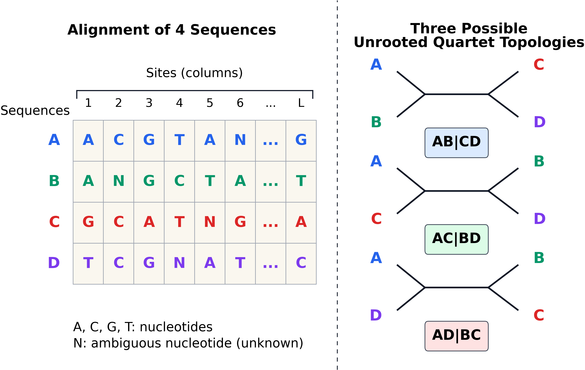
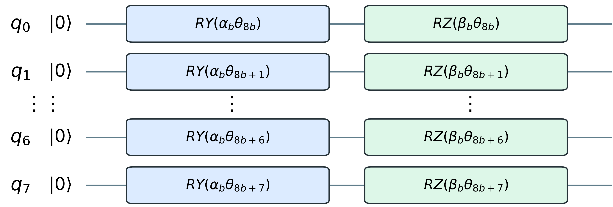
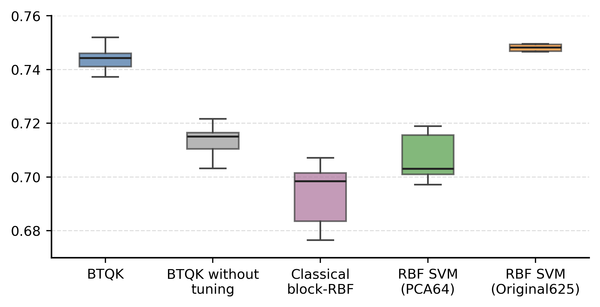
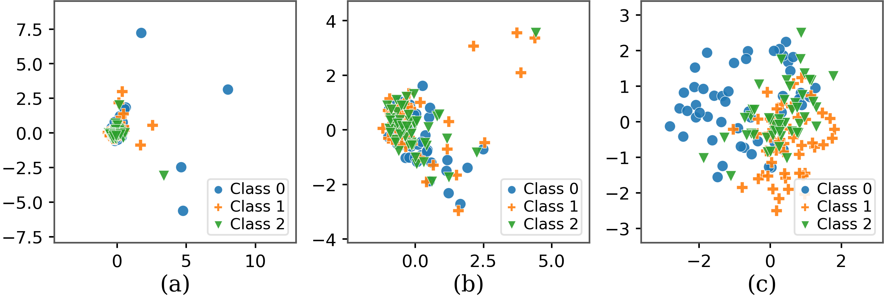

# Câu hỏi trung tâm

```{=latex}
\begin{center}
```

{width=60%}

```{=latex}
\end{center}
```

::: {.block}
## Bài toán

Từ **bốn chuỗi DNA đã căn chỉnh**, chọn đúng **một trong ba cây không gốc**.
:::



# Vì sao chỉ có ba đáp án?

Với bốn loài `A, B, C, D`, một cây không gốc nhị phân chỉ có ba cách ghép:

| Lớp | Topology | Diễn giải |
|:---:|:---:|:---|
| 0 | `AB|CD` | A gần B; C gần D |
| 1 | `AC|BD` | A gần C; B gần D |
| 2 | `AD|BC` | A gần D; B gần C |

::: {.alertblock}
## Cần phân biệt

Mô hình **không dựng toàn bộ cây loài**. Nó chỉ chọn topology cho từng nhóm bốn loài.
:::



# Toàn bộ pipeline trên một trang

:::: {.columns}
::: {.column width="58%"}
```text
4 chuỗi DNA đã căn chỉnh
            ↓
625 tần suất site-pattern
            ↓
PCA: 625 → 64 chiều
            ↓
8 khối × 8 đặc trưng
            ↓
8 quantum fidelity kernel
            ↓
Trung bình 8 kernel
            ↓
SVM → AB|CD, AC|BD hoặc AD|BC
```
:::

::: {.column width="38%"}
::: {.block}
## Hybrid quantum–classical

**Phần lượng tử**

Tám mạch lượng tử tạo các giá trị **độ tương đồng** giữa hai alignment.

**Phần cổ điển**

PCA xử lý đầu vào; phép trung bình kết hợp các kernel; SVM thực hiện **phân loại**.
:::
:::
::::



# Bước 1 - Biểu diễn alignment dưới dạng các đặc trưng

Mỗi cột của alignment chứa một ký tự từ `{A, C, G, T, N}` cho mỗi loài.

```text
              site i
Loài A     ...  A  ...
Loài B     ...  A  ...       → mẫu cột: AAGT
Loài C     ...  G  ...
Loài D     ...  T  ...
```

Có tất cả 5 ký tự, 4 loài:

$$5^4=625$$

mẫu cột có thể có. Một alignment được biểu diễn bằng **tần suất tương đối** của 625 mẫu này.



# Từ sinh học thành bài toán học máy

::: {.columns}
::: {.column width="47%"}
## Đầu vào

$$\mathbf{x}\in\mathbb{R}^{625}$$

- Một vector cho mỗi alignment
- Không phụ thuộc thứ tự các site
- Nhãn là một trong ba topology
:::

::: {.column width="6%"}

$$\Rightarrow$$
:::

::: {.column width="47%"}
## Mục tiêu

$$f(\mathbf{x})\in\{0,1,2\}$$

- Học từ các alignment đã có nhãn
- Đánh giá trên alignment chưa thấy
- So sánh với SVM và IQ-TREE
:::
:::

::: {.block}
## Câu hỏi của bài báo

Một **quantum kernel** có tạo ra thước đo tương đồng hữu ích hơn kernel cổ điển trên cùng dữ liệu không?
:::



# Bước 2 - Giảm chiều dữ liệu với PCA

Mô phỏng trực tiếp một mạch cho 625 đặc trưng là quá tốn kém.

$$
\underbrace{\mathbb{R}^{625}}_{\text{tần suất site-pattern}}
\xrightarrow{\text{PCA}}
\underbrace{\mathbb{R}^{64}}_{\text{PCA64}}
$$

- PCA được fit trên **415.303 alignment huấn luyện**, không dùng nhãn.
- 64 thành phần giữ **99,09% phương sai**.
- Các thành phần vẫn được sắp theo lượng phương sai giải thích.

::: {.alertblock}
## Đánh đổi

Giữ gần hết phương sai không đồng nghĩa với giữ toàn bộ thông tin hữu ích cho phân loại.
:::



# Bước 3 - Biến một con số (1 đặc trưng) thành góc quay

Mỗi thành phần PCA được xử lý chỉ bằng thống kê của tập train:

$$
x_j
\xrightarrow{\text{median/IQR}}
s_j
\xrightarrow{\text{clip }[-3,3]}
\theta_j\in[0,\pi/2].
$$

Sau đó, $\theta_j$ điều khiển hai cổng quay trên một qubit:

$$
|0\rangle
\xrightarrow{R_Y(\alpha_b\theta_j)}
\xrightarrow{R_Z(\beta_b\theta_j)}
|\phi_j(x)\rangle.
$$

::: {.block}
## Trực giác

Hai mẫu có các góc gần nhau sẽ tạo ra các trạng thái gần nhau.
:::



# Bước 4 - Từ 64 góc đến tám block

Với **một alignment**, 64 góc được chia liên tiếp thành tám nhóm:

$$
\boldsymbol\theta^{(i)}=
[\underbrace{\theta_1,\ldots,\theta_8}_{\text{block 1}}\mid
\underbrace{\theta_9,\ldots,\theta_{16}}_{\text{block 2}}\mid\cdots\mid
\underbrace{\theta_{57},\ldots,\theta_{64}}_{\text{block 8}}].
$$

Áp dụng cách chia này cho **mọi alignment**:

```text
Dataset: n hàng × 64 góc
             ↓ chia theo cột
8 bảng dữ liệu: mỗi bảng n hàng × 8 góc
             ↓
Mỗi hàng đi qua cùng một mạch 8 qubit
```

::: {.block}
## Vì sao phải chia block?

**64 qubit:** $2^{64}$ biên độ  $\qquad$ **8 qubit/block:** $2^8$ biên độ.
:::



# Một block lượng tử gồm tám đặc trưng
```{=latex}
\begin{center}
```
{width=76%}
```{=latex}
\end{center}
```

Mỗi block dùng **8 qubit**, mỗi qubit nhận một thành phần PCA.

$$
|\phi_b(\mathbf{x})\rangle=
\bigotimes_{q=0}^{7}
R_Z(\beta_b\theta_{8b+q})R_Y(\alpha_b\theta_{8b+q})|0\rangle.
$$

Không có cổng nối giữa các qubit: mạch cuối cùng **không entanglement**.



# Quantum kernel đo điều gì?

Với hai alignment $\mathbf{x}$ và $\mathbf{z}$:

$$
k_b(\mathbf{x},\mathbf{z})
=|\langle\phi_b(\mathbf{x})|\phi_b(\mathbf{z})\rangle|^2.
$$

::: {.columns}
::: {.column width="48%"}
## $k_b\approx 1$

Hai trạng thái gần giống nhau  
$\Rightarrow$ hai mẫu được xem là gần nhau.
:::

::: {.column width="48%"}
## $k_b\approx 0$

Hai trạng thái rất khác nhau  
$\Rightarrow$ hai mẫu được xem là xa nhau.
:::
:::

Tính cho mọi cặp mẫu sẽ tạo ra **ma trận kernel** mà SVM có thể sử dụng trực tiếp.



# Ghép kết quả của tám block

:::: {.columns}
::: {.column width="47%"}
::: {.block}
## Tám kernel đầu vào

$$K_1,\ K_2,\ \ldots,\ K_8$$

- Mỗi $K_b$ đến từ một block.
- Mỗi phần tử là độ tương đồng giữa hai alignment theo **8 đặc trưng**.
:::
:::

::: {.column width="49%"}
::: {.block}
## Một kernel đầu ra

$$K=\frac{1}{8}\sum_{b=1}^{8}K_b$$

$$K\ \longrightarrow\ \text{SVM}\ \longrightarrow\ \widehat y$$

SVM chỉ nhận ma trận $K$ tổng hợp.
:::
:::
::::

::: {.alertblock}
## Đánh đổi

Không biểu diễn trực tiếp tương tác giữa các đặc trưng thuộc **hai block khác nhau**.
:::




# Thiết kế thí nghiệm

| Thành phần | Thiết lập |
|:---|:---|
| Biểu diễn | Original625 và PCA64 |
| Train | 10 tập cân bằng, rời nhau; 500 mẫu/tập |
| Validation | 41.529 mẫu cân bằng |
| Test nội bộ | 51.241 mẫu EvoNAPS |
| Test ngoài | 116.776 mẫu TreeBASE |
| Bộ phân loại | SVM với kernel dựng sẵn, $C=0.5$ |
| Chỉ số | Accuracy và macro-F1 |

Kết quả dạng $\text{mean}\pm\text{std}$ được tính trên 10 tập train.



# Sàng lọc feature map

**Rotation:** `RY`, `RY–RZ`, `RX–RY–RZ`  
**Interaction:** `none`, `CNOT`, `DZZ`

Trong chín candidate, họ **RY–RZ** cho validation Macro-F1 tốt nhất.

| Candidate RY–RZ | Không tuning | Sau tuning |
|:---|---:|---:|
| RY–RZ / DZZ | 0.7138 ± 0.0075 | 0.7446 ± 0.0079 |
| **RY–RZ / none** | **0.7137 ± 0.0070** | **0.7445 ± 0.0079** |
| RY–RZ / CNOT | 0.7137 ± 0.0070 | 0.7445 ± 0.0079 |

Sau tuning, điểm số chênh không quá **0,0001**; thời gian/mẫu: DZZ **25 ms**, none **20 ms**, CNOT **27 ms**. Chọn **RY–RZ/none**: nhanh nhất, không entanglement.



# Kết quả trên test nội bộ

::: {.columns}
::: {.column width="55%"}
{width=100%}
:::

::: {.column width="45%"}
| Phương pháp | Macro-F1 |
|:---|---:|
| IQ-TREE | **0.8108** |
| RBF Original625 | **0.7487** |
| **BTQK PCA64** | **0.7428 ± 0.0070** |
| BTQK chưa tuning | 0.7127 ± 0.0070 |
| RBF PCA64 | 0.7072 ± 0.0084 |
| Block-RBF | 0.6939 ± 0.0109 |
:::
:::

**So sánh công bằng trên PCA64:** BTQK hơn RBF **3,56 điểm phần trăm**.



# Đọc kết quả

::: {.block}
## Bài báo chứng minh được

- Tuning cải thiện BTQK khoảng 3 điểm F1.
- BTQK tốt hơn các SVM dùng cùng PCA64.
- Hiệu quả ổn định trên 10 split.
:::

::: {.block}
## Kết luận đúng mức

BTQK là một cách xây dựng biểu diễn cạnh tranh khi đầu vào bị giới hạn ở PCA64.
:::



# Không gian biểu diễn thay đổi ra sao?

{width=95%}

| (a) | (b) | (c) |
|:---:|:---:|:---:|
| Original625 → PCA 2D | Hai PC đầu của PCA64 | BTQK đã tuning → kernel PCA |



# Khái quát sang TreeBASE

| Phương pháp | Test nội bộ | TreeBASE |
|:---|---:|---:|
| IQ-TREE | 0.8108 | **0.8082** |
| **BTQK** | **0.7428** | **0.6276** |
| RBF PCA64 | 0.7072 | 0.6003 |
| Linear PCA64 | 0.7047 | 0.5964 |

::: {.alertblock}
## Generalization gap

BTQK vẫn là mô hình PCA64 tốt nhất, nhưng giảm **11,52 điểm F1** khi chuyển sang dữ liệu ngoài.
:::

IQ-TREE gần như giữ nguyên hiệu năng, cho thấy các mô hình học máy nhạy hơn với thay đổi phân phối dữ liệu.



# Phần “quantum” nằm ở đâu?

Trong nghiên cứu này:

- Mạch được chạy bằng **state-vector simulator**, không phải phần cứng lượng tử.
- Mạch cuối không entanglement; trạng thái 8 qubit là tích của 8 trạng thái một qubit.
- Vì vậy kernel đã chọn có thể được tính hiệu quả bằng phương pháp cổ điển.

::: {.block}
## Cách diễn giải thận trọng

Kết quả có thể đến từ **biến đổi lượng giác + tuning theo block**
:::



# Hạn chế và hướng tiếp theo

::: {.columns}
::: {.column width="48%"}
## Hạn chế

- Chỉ 500 mẫu train mỗi split
- Mô phỏng lý tưởng, chưa có noise
- Chia block liên tiếp theo thứ tự PCA
- Trung bình block với trọng số bằng nhau
- Generalization gap trên TreeBASE
:::

::: {.column width="48%"}
## Hướng tiếp theo

- Kernel approximation để mở rộng dữ liệu
- Học trọng số cho từng block
- Chia block theo cấu trúc dữ liệu
- So sánh với classical kernel cùng ngân sách tuning
- Thử trên hardware có noise
:::
:::



# Ba điều cần nhớ

::: {.block}
## 1. Bài toán

Quartet inference là phân loại một trong ba topology từ bốn chuỗi DNA.
:::

::: {.block}
## 2. Phương pháp

BTQK chia PCA64 thành tám block, tạo tám fidelity kernel rồi đưa kernel trung bình vào SVM.
:::

::: {.block}
## 3. Kết quả

BTQK tốt hơn các SVM dùng cùng PCA64, nhưng chưa vượt IQ-TREE hay RBF dùng đủ 625 đặc trưng; chưa có quantum advantage.
:::



# Tài liệu

- H. T. Giang et al., *Towards Quantum Machine Learning for Quartet Topology Inference: A Quantum Kernel Approach*.
- Mã tái lập: <https://github.com/dung321046/BTQK/>
- Dữ liệu nền: C. Yang et al., *IQ-NET*, 2025.
